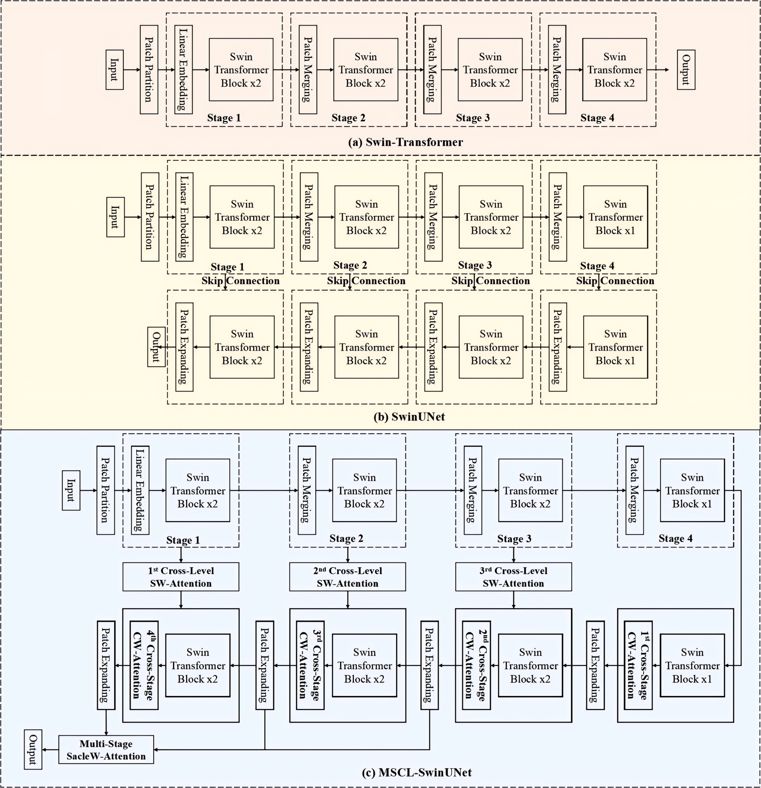

 the project is still being organized. 

# MSCL-SwinUNet

This repo is the implementation of ["Multi-Scheme Cross-Level Attention Embedded U-shape Transformer for MRI Semantic Segmentation"]. we refer to  [MMSegmentation](https://github.com/open-mmlab/mmsegmentation) and [MMGeneration](https://github.com/open-mmlab/mmgeneration) and Supervised MRI Semantic Segmentation task. Many thanks to SenseTime and their two excellent repos.


<table>
  <tr>
    <td rowspan="2">
      
    </td>
    <td>
      
    </td>
  </tr>
  <tr>
    <td>
      
    </td>
  </tr>
</table>


## Dataset

To evaluate the performance and generalization ability of the proposed MSCL-SwinUNet, we conducted experiments on three benchmark datasets across different imaging modalities.The **ACDC (Automatic Cardiac Diagnosis Challenge)** dataset is an MRI-based cardiac imaging dataset comprising **150 examinations** from different patients. It provides **pixel-level annotations** for **three anatomical structures**, namely the **left ventricle (LV)**, **right ventricle (RV)**, and **myocardium (MYO)**.The **MM-WHS (Multi-Modality Whole Heart Segmentation)** dataset includes **two imaging modalities**, consisting of **52 CT scans** and **46 MR scans**.To further assess cross-modality generalization, we employed the **Synapse multi-organ segmentation dataset**, which contains **3,779 CT images** spanning **30 anatomical categories**.


## SwinUNet

### Install

1. requirements:
    
    python >= 3.7
        
    pytorch >= 1.4
        
    cuda >= 10.0
    
2. prerequisites: Please refer to  [MMSegmentation PREREQUISITES](https://mmsegmentation.readthedocs.io/en/latest/get_started.html); Please don't forget to install mmsegmentation with

     ```
     cd MSCL-SwinUNet
     
     pip install -e .
     
     chmod 777 ./tools/dist_train.sh
     
     chmod 777 ./tools/dist_test.sh
     ```

### Training

**swin_base_patch4_window7_224_22k.pth** : Before training SwinUNet , loading ImageNet-pretrained swin_base_patch4_window7_224_22k.pth is very useful. We provide this pretrained backbone here. The pretrained backbone has already been transformed to fit for our repo.

#### Task1: Segmentation  on ACDC dataset

<table>
    <tr>
    <td></td>
    </tr>
</table>
  
     cd MSCL-SwinUNet
     
     ./tools/dist_train.sh ./experiments/MSCL_SwinUNet_160k_WHS/config/MSCL_SwinUNet_160k_WHS.py 2 2

#### Task2: Segmentation  on the MRI and CT subset of MM-WHS dataset

<table>
    <tr>
    <td></td>
    </tr>
</table>
  
     cd MSCL-SwinUNet
     
     ./tools/dist_train.sh ./experiments/MSCL_SwinUNet_160k_WHS/config/MSCL_SwinUNet_160k_WHS.py 2 2


#### Task3: Segmentation  on Synapse dataset

<table>
    <tr>
    <td></td>
    </tr>
</table>
  
     cd MSCL-SwinUNet
     
     ./tools/dist_train.sh ./experiments/MSCL_SwinUNet_160k_WHS/config/MSCL_SwinUNet_160k_WHS.py 2 2


### Testing

#### Task1: Segmentation  on ACDC dataset
  
     cd MSCL-SwinUNet
     
     ./tools/dist_test.sh ./experiments/MSCL_SwinUNet_160k_WHS/config/MSCL_SwinUNet_160k_WHS.py ./experiments/MSCL_SwinUNet_160k__WHS/results/iter_80000.pth 2 --eval mDice

#### Task2: Segmentation  on the MRI and CT subset of MM-WHS dataset
  
     cd MSCL-SwinUNet
     
     ./tools/dist_test.sh ./experiments/MSCL_SwinUNet_160k_WHS/config/MSCL_SwinUNet_160k_WHS.py ./experiments/MSCL_SwinUNet_160k__WHS/results/iter_80000.pth 2 --eval mDice

#### Task3: Segmentation  on Synapse dataset
  
     cd MSCL-SwinUNet
     
     ./tools/dist_test.sh ./experiments/MSCL_SwinUNet_160k_WHS/config/MSCL_SwinUNet_160k_WHS.py ./experiments/MSCL_SwinUNet_160k__WHS/results/iter_80000.pth 2 --eval mDice

## Description of MSCL-SwinUNet

If you have any question, please discuss with me by sending email to wq@cap.edu.cn.


# References
Many thanks to their excellent works
* [MMSegmentation](https://github.com/open-mmlab/mmsegmentation)
* [MMGeneration](https://github.com/open-mmlab/mmgeneration)
